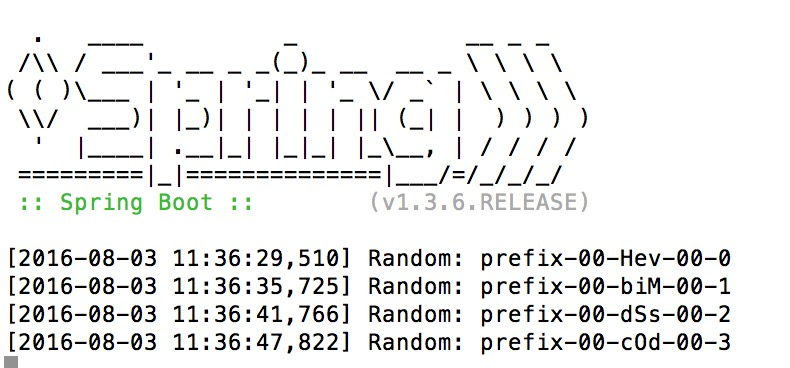
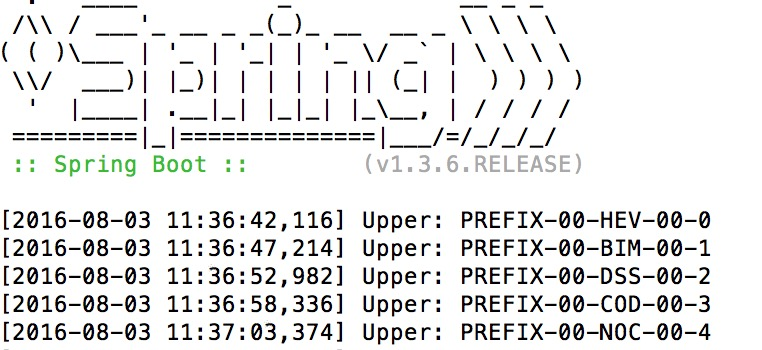
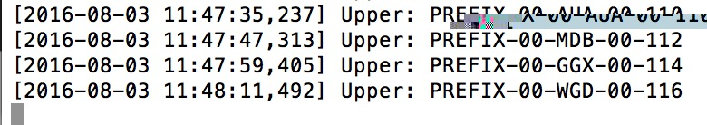
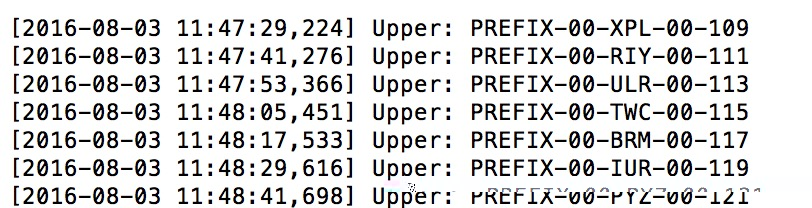
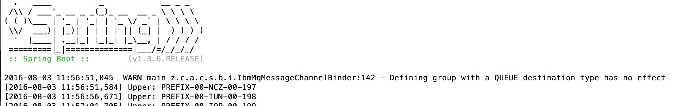
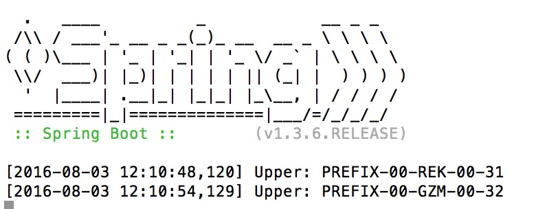

# spring-cloud-stream-binder-ibmmq

[Spring Cloud Stream Binder](https://github.com/spring-cloud/spring-cloud-stream) implementation for [IBM MQ](http://www-03.ibm.com/software/products/en/ibm-mq)

# IBM MQ Setup
1. Login to the docker host, if running windows or Mac, the command will be something like

    `docker-machine ssh default`

2. Update maximum open files settings

    `sudo sysctl -w fs.file-max=2000000`

3. Navigate to `docker` folder of the submission and build the custom docker image

    `docker build -t mq-for-binder .`

4. Run the following to start server

    `docker --debug  run --env LICENSE=accept --env MQ_QMGR_NAME=QM1 --volume /mnt/sda1/mq-binder:/var/mqm --name ibmmq-for-binder --publish 1414:1414  --detach mq-for-binder`

# Build the binders and demos
## Prerequisites
1. Java 8
2. Maven 3.3.9

## Build
1. Install native MQ library, from `/lib` directory run

    `mvn install:install-file -Dfile=com.ibm.mq.allclient.jar -DpomFile=com.ibm.mq.allclient.pom.xml`

2. From the root submission directory, run

    `mvn clean install -P spring`

# Verification

In the verification steps below, we will use the two supplied demos, demo-sender and demo-receiver. 

To run a demo with the supplied command you will need to navigate to the relevant demo sub-directory.

## Common Configuration

update the `src/main/resources/application.properties` files in demo-sender and demo-receiver apps with the correct
values for your environment, specifically, you will need to set the following properties (the values below are the default)

   
    spring.ibmmq.host=127.0.0.1
    spring.ibmmq.port=1414
    spring.ibmmq.qm=QM1
    spring.ibmmq.username=?
    spring.ibmmq.password=?
    spring.ibmmq.channel=SYSTEM.DEF.SVRCONN
    

## Sender/Receiver With Queue Destination and No Consumer Grouping
1. Update the `src/main/resources/application.properties` file of the demo-sender and make sure it contains the following setting
    
    `spring.cloud.stream.ibmmq.binder.default-destination-type=queue`

2. Run Sender
    
    `mvn spring-boot:run -Drun.arguments="--server.port=8881"`
    
    
    
    Please note the generated strings with the index suffex that will be used to track the messages when running receivers.
    
3. Update the `src/main/resources/application.properties` file of the demo-receiver and make sure it contains the following setting
       
    `spring.cloud.stream.ibmmq.binder.default-destination-type=queue`
    
4. Run Receiver

    `mvn spring-boot:run -Drun.arguments="--server.port=8882"`
        
    
    
5. Run Multiple Receivers
    Just make sure to change the server.port for each receiver
    
    `mvn spring-boot:run -Drun.arguments="--server.port=8883"`
    
    First receiver log
    
    
    
    Second receiver log
    
    

    Note that the receivers are competing for the messages.

## Sender/Receiver With Queue Destination and with Consumer Grouping
1. Keep the sender running 
2. Terminate the receivers
3. Re-run the first receiver with the following command 
    
    `mvn spring-boot:run -Drun.arguments="--server.port=8882,--spring.cloud.stream.bindings.input.group=group1"`
    
    
    
    The grouping with a Queue Destination type has no sense, so it has no effect on functionality and a warning message
    is logged in this case.
    
## Sender/Receiver With Topic Destination and No Consumer Grouping
1. Terminate the sender and receivers
2. Update the `src/main/resources/application.properties` file of the demo-sender and demo-receiver and make 
sure it contains the following setting
       
       `spring.cloud.stream.ibmmq.binder.default-destination-type=topic`
       
3. Run sender
      
      `mvn spring-boot:run -Drun.arguments="--server.port=8881"`
      
      
      
4. Run Multiple Receivers
      
      `mvn spring-boot:run -Drun.arguments="--server.port=8882"`
      
      
      
      
      `mvn spring-boot:run -Drun.arguments="--server.port=8883"`
      
      
      
     
      Note that each receiver will receive a copy of the messages (i.e a pub/sub model)

## Sender/Receiver With Topic Destination and with Consumer Grouping
1. Keep sender running
2. Terminate all receivers
3. Run multiple receivers with different groups

    `mvn spring-boot:run -Drun.arguments="--server.port=8882,--spring.cloud.stream.bindings.input.group=group1"`
    
    `mvn spring-boot:run -Drun.arguments="--server.port=8883,--spring.cloud.stream.bindings.input.group=group1"`
    
    `mvn spring-boot:run -Drun.arguments="--server.port=8884,--spring.cloud.stream.bindings.input.group=group2"`
    
    `mvn spring-boot:run -Drun.arguments="--server.port=8885,--spring.cloud.stream.bindings.input.group=group2"`
    
    Please note that receivers in the same group will compete for messages while each group will receive a complete 
    copy of messages
    
## Sender/Receiver With Topic Destination, Consumer Grouping and Partitioning
### Scenario
In this scenario we will configure a partitioned pub/sub based on the suffix index in the generated random string

1. We will have 5 partitions, each one is responsible to handle the modulo 5 of the suffix index 

    For example, the message "prefix-00-ehU-00-3" will have suffix index equal 3 and will be routed to partition 3%5 = 3
    
    And the message "prefix-00-aXu-00-11" will have suffix index equal to 11 and will be routed to partition 11%5 = 1

2. We will have multiple receivers that will subscribe to one of the partitions and so will ONLY receive messages related to this partition.

### Steps
1. Terminate the sender and receivers.
2. Update application.properties of the sender to enable partitioning

    `# partition the topic using the suffix index in the produced messages`
    
    `spring.cloud.stream.bindings.output.producer.partitionKeyExpression=T(java.lang.Integer).parseInt(payload.substring(17))`
    
    `spring.cloud.stream.bindings.output.producer.partitionCount=5`
    
    `spring.cloud.stream.bindings.output.producer.required-groups[0]=group1`
    
    `spring.cloud.stream.bindings.output.producer.required-groups[1]=group2`
    
    The required-groups property will trigger the creation of required durable subscriptions before any message is sent.
    
3. Run the sender

    `mvn spring-boot:run -Drun.arguments="--server.port=8881"`

4. Update application.properties of the receiver to enable partitioning
    
    `spring.cloud.stream.bindings.input.consumer.partitioned=true`
    `spring.cloud.stream.instance-count=5`

5. Run multiple receivers

    1. `mvn spring-boot:run -Drun.arguments="--server.port=8882,--spring.cloud.stream.bindings.input.group=group1,--spring.cloud.stream.instance-index=0"`
    2. `mvn spring-boot:run -Drun.arguments="--server.port=8883,--spring.cloud.stream.bindings.input.group=group1,--spring.cloud.stream.instance-index=0"`
    3. `mvn spring-boot:run -Drun.arguments="--server.port=8884,--spring.cloud.stream.bindings.input.group=group2,--spring.cloud.stream.instance-index=0"`
    4. `mvn spring-boot:run -Drun.arguments="--server.port=8885,--spring.cloud.stream.bindings.input.group=group1,--spring.cloud.stream.instance-index=1"`
    5. `mvn spring-boot:run -Drun.arguments="--server.port=8886,--spring.cloud.stream.bindings.input.group=group1,--spring.cloud.stream.instance-index=2"`
    6. `mvn spring-boot:run -Drun.arguments="--server.port=8887,--spring.cloud.stream.bindings.input.group=group1,--spring.cloud.stream.instance-index=3"`
    7. `mvn spring-boot:run -Drun.arguments="--server.port=8888,--spring.cloud.stream.bindings.input.group=group1,--spring.cloud.stream.instance-index=4"`
    
    In this topology we have
    
    * Receiver #1 and #2 both in "group1" will compete for messages in partition 0
    * Receiver #3 in "group2" will receive another copy of messages in partition 0
    * Receiver #4 in "group1" will receive messages in partition 1
    * Receiver #5 in "group1" will receive messages in partition 2
    * Receiver #6 in "group1" will receive messages in partition 3
    * Receiver #7 in "group1" will receive messages in partition 4
    
